# Love Court 项目说明书

AI情侣法庭是一款把情侣、朋友、室友之间的小矛盾变成“开庭审理”的 AI 娱乐产品。

它的核心价值不是判断谁绝对正确，而是把争执变成一个更轻、更好笑、更容易被双方接受的互动过程。

## 一句话

情侣吵架别冷战，来开庭。

## 产品定位

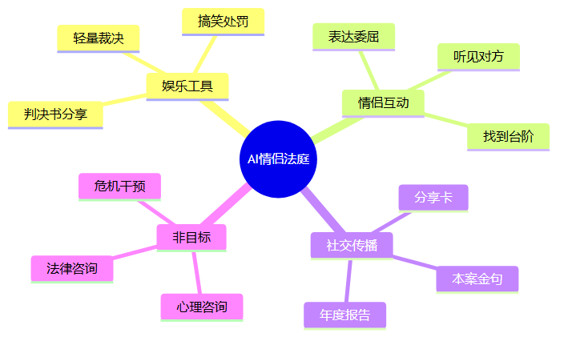

## 核心体验

用户应该感觉自己不是在填一份严肃表格，而是在发起一场“爱情法庭审理”。

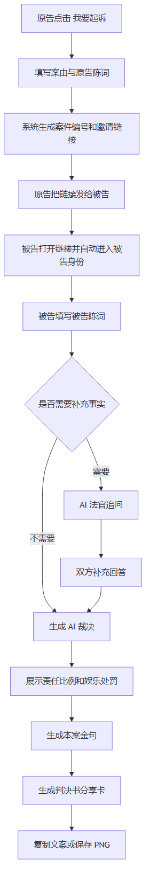

## 页面结构

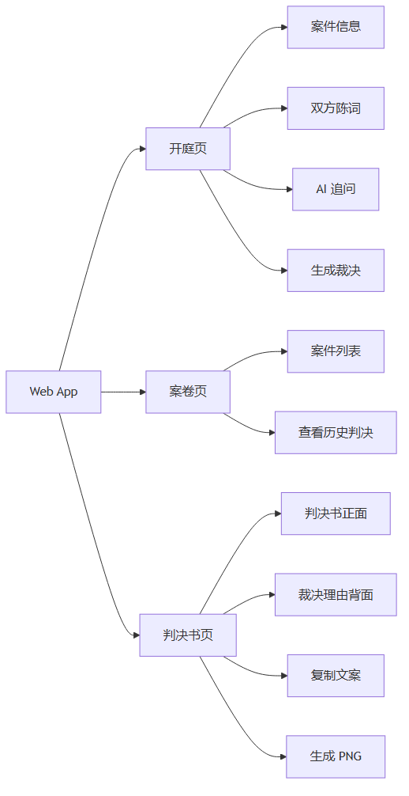

## 系统架构

当前版本是 Web MVP，前后端都在一个轻量 Node.js 服务里，适合快速验证玩法。

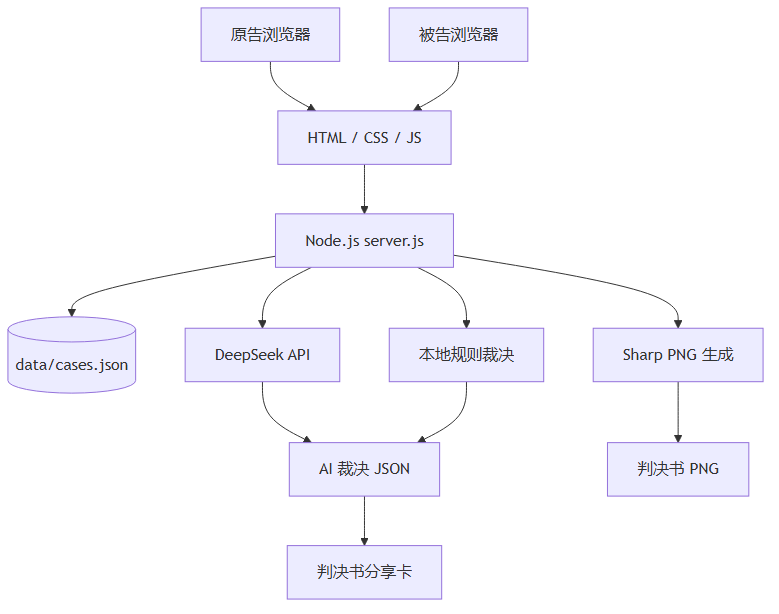

## 数据流

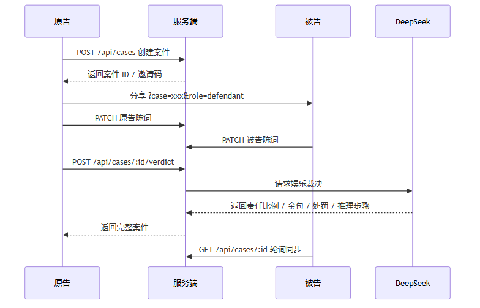

## AI 裁决结构

AI 输出不是自由聊天，而是一份结构化裁决。

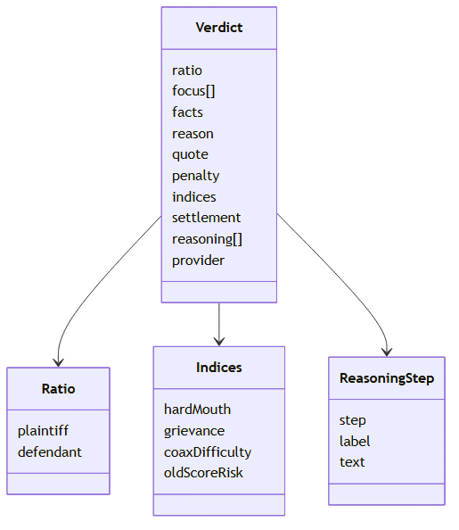

## 裁决风格

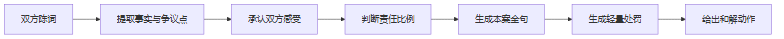

裁决文案要求：

- 像一本正经的爱情法庭判决书
- 有轻微幽默感，但不羞辱任何一方
- 不劝分，不扩大矛盾
- 不提供法律、医疗、投资等高风险建议
- 处罚必须轻量、可执行、适合转发

## 分享卡设计

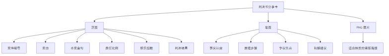

## 当前文件职责

| 文件 | 职责 |
| --- | --- |
| `index.html` | 页面结构，包含开庭、案卷、判决书三个视图 |
| `styles.css` | 视觉风格、移动端布局、判决卡翻牌效果 |
| `app.js` | 前端状态、案件同步、身份识别、裁决卡渲染 |
| `server.js` | API 服务、案件存储、AI 裁决、PNG 生成 |
| `data/cases.json` | 本地案件数据，不提交到 GitHub |
| `PRD.md` | 产品需求说明 |
| `ROADMAP.md` | 版本路线图 |

## 代码逻辑映射

这张图用来帮助新加入的同学快速找到“某个功能应该看哪段代码”。

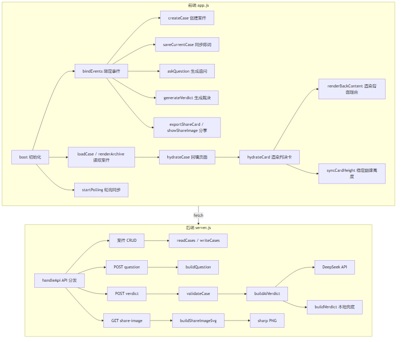

## 前端状态流

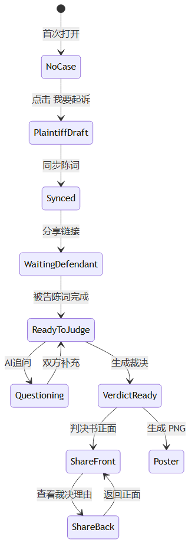

## 后端 API 分发逻辑

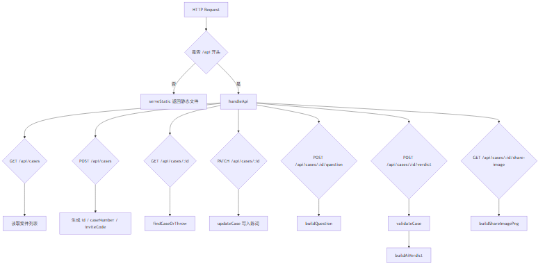

## 裁决生成链路

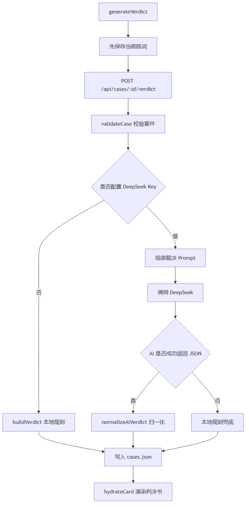

## 判决书 PNG 生成链路

## 协作方式

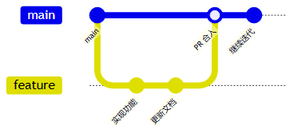

推荐规则：

- 小步提交，每次改动目标明确
- 功能改动同步更新 README 或 ROADMAP
- PR 描述写清楚“改了什么、为什么改、怎么验证”
- 不提交 `.env`、`data/`、`shots/`、`node_modules/`

## 小程序迁移路线

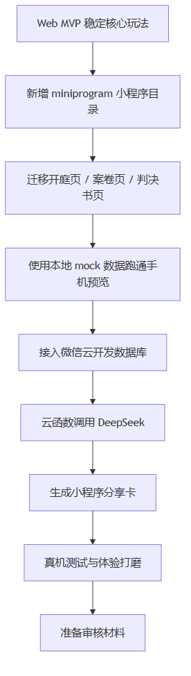

迁移原则：

- Web 版本继续保留，作为快速验证和调试入口
- 小程序先做预览版，不急着上线
- 先跑通核心链路，再处理登录、云数据库、审核材料

## 下一步优化方向

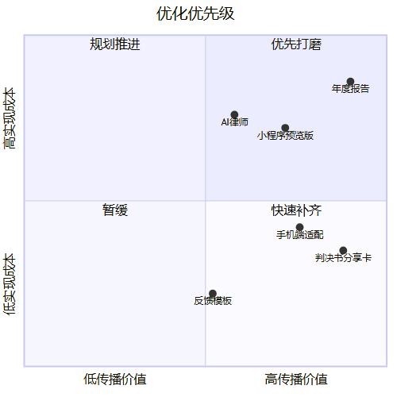

当前最值得继续做的两件事：

1. 打磨手机端判决书体验，让截图更像能分享的内容。
2. 新增小程序预览版骨架，为微信真机测试做准备。
