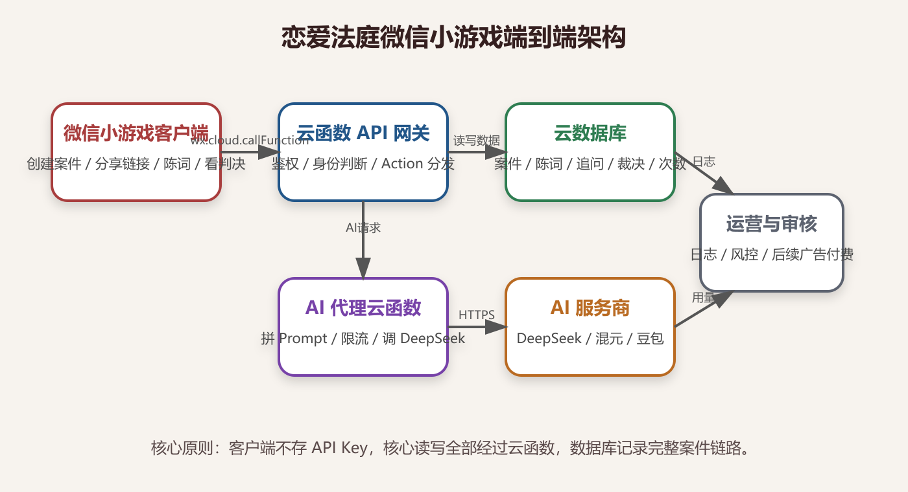
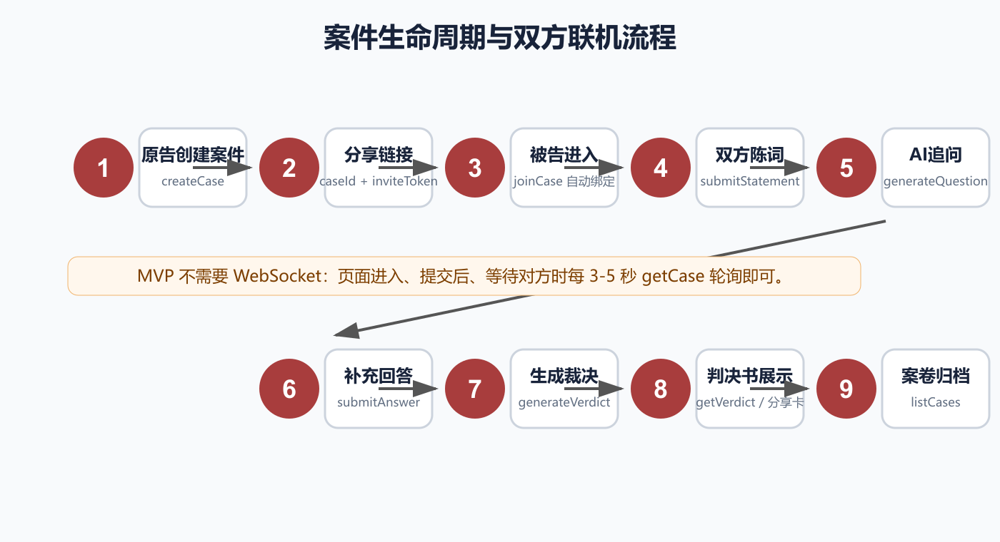
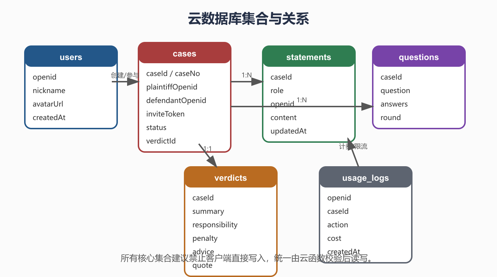
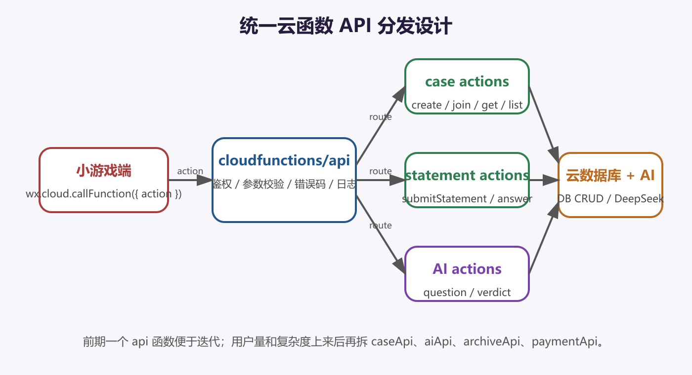

# AI情侣法庭微信小游戏端到端技术方案

> 版本：V1.0  日期：2026-06-17

## 1. 方案结论

短期采用“微信小游戏 + 微信云开发 + 云数据库 + 云函数 + DeepSeek”的方案，不自建服务器。客户端只做展示、输入、分享和状态刷新；云函数承担鉴权、身份判断、数据读写、AI Key 保护、调用次数控制和 AI 代理。

## 2. 核心原则

- DeepSeek API Key 只放在云函数环境变量，不进入小游戏前端。
- 核心集合不允许客户端直接写入，所有关键操作走云函数。
- 身份不让用户选择：创建者为原告，通过邀请链接进入者为被告。
- MVP 不做实时 WebSocket，先用 3-5 秒轮询完成联机同步。
- 当前版本不接充值、广告、商城和道具，后续商业化再补资质和审核材料。

## 3. 案件流程

## 4. 数据模型

## 5. API 分发

## 6. 落地顺序

1. 建微信小游戏项目骨架。
2. 开通云开发环境。
3. 建 users、cases、statements、questions、verdicts、usage_logs 集合。
4. 实现 cloudfunctions/api 统一入口。
5. 实现 createCase、joinCase、getCase。
6. 实现 submitStatement。
7. 实现 generateQuestion 和 submitAnswer。
8. 实现 generateVerdict。
9. 实现历史案卷和判决书分享卡。
10. 稳定后再考虑广告激励或付费次数。
